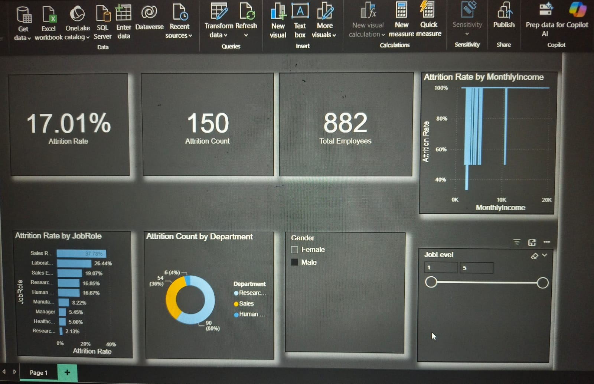

# HR Analytics - Employee Attrition Prediction

## Project Overview

This project analyzes a fictional HR dataset from IBM to uncover the key drivers of employee attrition. The goal was to build a predictive model to identify employees at risk of leaving and to create an interactive Power BI dashboard for stakeholders to explore the data. This project was completed as part of an internship with Elevate Labs.

---

## Tools Used

* **Python:** Pandas (for data cleaning), Scikit-learn (for modeling)
* **Power BI:** For creating the interactive dashboard and visualizations.
* **Jupyter Notebook:** As the development environment for the Python code.

---

## Key Findings & Recommendations

The analysis revealed several key factors influencing attrition:
* **Job Role:** Sales Representatives have the highest attrition rate.
* **Monthly Income:** Attrition is significantly higher for employees in lower income brackets.
* **Department:** The Sales department has the highest number of employees leaving.

**Recommendations:**
1.  Review compensation for high-risk roles.
2.  Implement clearer career pathing for junior employees.
3.  Conduct focused exit interviews to gather more detailed feedback.

---

## Dashboard Screenshot

Here is a preview of the interactive Power BI dashboard.

---

## How to Use This Repository

1.  **`HR_Attrition_Analysis.ipynb`:** The Jupyter Notebook containing all the Python code for data cleaning and model building.
2.  **`cleaned_hr_data.csv`:** The cleaned dataset required to run the notebook.
3.  **`HR_Attrition_Dashboard.pbix`:** The Power BI file. You will need Power BI Desktop to open this.
4.  **`HR_Attrition_Report.pdf`:** The final 2-page project summary report.
